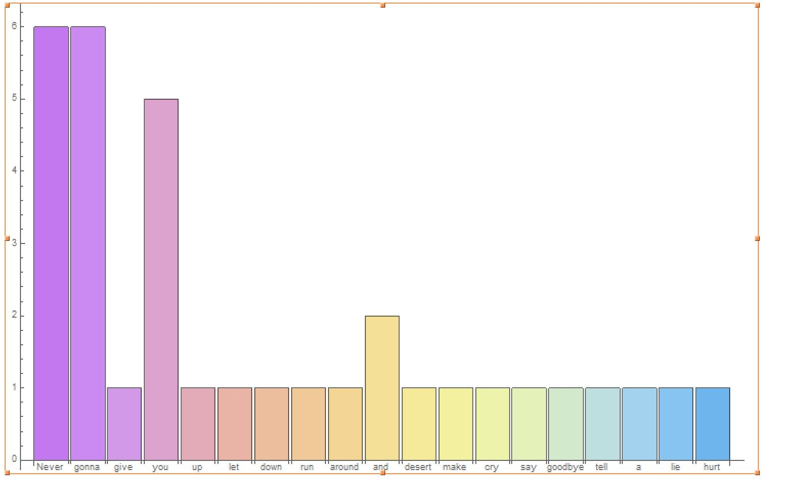
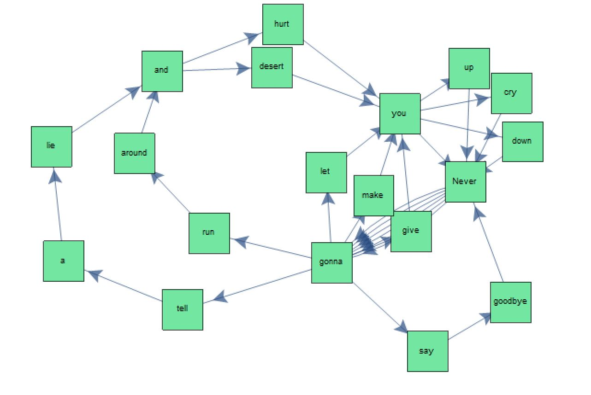
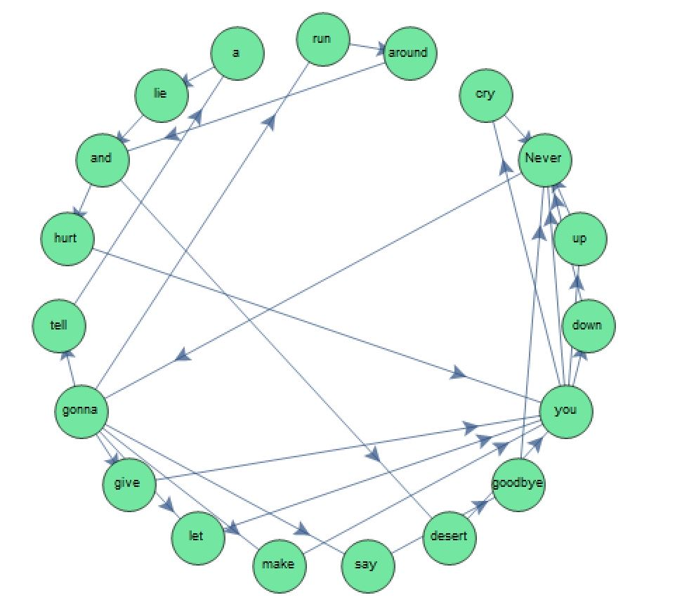

# Markov Model with Rick Astley
Following this introduction to Markov Models but using Mathematica
[Intro to Markov Models with Swift](https://www.twilio.com/blog/intro-to-markov-models-with-swift)
### Histogram

### States

### States with no Duplicates

